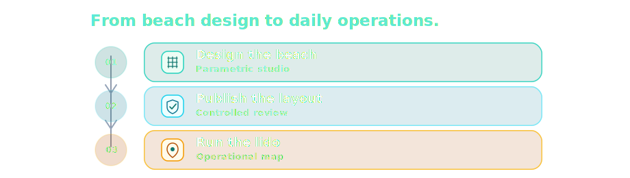

<p align="center">
  
</p>

<p align="center">
  <strong>Commercial operating platform for beach establishments.</strong>
</p>

<p align="center">
  LidoPro is a proprietary commercial operating platform for beach establishments, combining parametric space planning, map-based daily operations, reservations, customer management, pricing, accounts, and service workflows into one connected product surface.
</p>

<p align="center">
  <em>Gestionale operativo per stabilimenti balneari: progettazione, mappa operativa, prenotazioni, clienti, listino, conti e servizi.</em>
</p>

<p align="center">
  
  
  
  
  
  
</p>

<p align="center">
  
</p>

<p align="center">
  <em>LidoPro desktop preview — operational beach map, selected place detail, and local booking/account workflow.</em>
</p>

## Product Overview

LidoPro starts from the beach map as the operational surface. Lido Studio handles parametric design and planning of the beach layout, while the active operational map is the protected daily surface used by staff.

Each place, reservation, customer, account state, equipment record, and operational event should be connected through the same product surface rather than living in isolated screens.

The current implementation is local-first and operator-focused. The broader product direction is a connected commercial platform for beach operations, including beach management, bar/service operations, customer booking, real payments, cloud synchronization, multi-device accounts, and intelligent operational assistance when implemented and released.

<p align="center">
  
</p>

## Product Pillars

| Pillar | Scope | Status |
| --- | --- | --- |
| Parametric Beach Studio | Design and verify beach layouts before publication. | Implemented / evolving |
| Active Operational Map | Protected daily map for places, reservations, customers, and account state. | Implemented / evolving |
| Booking and Customer Operations | Reservations, assignments, customer records, activity, and local workflow history. | Implemented / evolving |
| Catalog, Pricing, and Accounts | Tariffs, extras, articles, local ledger, and payment-record foundations. | Implemented / evolving |
| Bar and Service Operations | Orders, service items, food/beverage flows, and beach delivery workflows. | Product domain / not fully released |
| Connected Platform Direction | Cloud sync, customer portal, real payments, multi-device accounts, and intelligent assistance. | Strategic boundary / not live |

## Operational Layout Model

LidoPro separates design work from daily operations. Studio drafts can be edited and reviewed, while the active layout remains the protected operational surface used by staff.

<p align="center">
  
</p>

The publication step is the boundary between planning and operations: drafts do not directly mutate customer, reservation, account, or daily workflow data.

## Current Status

| Area | Status |
| --- | --- |
| Product stage | Active development / commercial pre-release |
| Current runtime posture | Local-first operator application |
| Primary desktop runtime | Tauri Desktop |
| Primary field validation target | Android tablet |
| Browser | Development preview only |
| Not live unless released | Cloud sync, customer portal, real payments, hosted booking, SaaS operation, AI assistant |

## Commercial and Repository Status

LidoPro is proprietary commercial software. This repository is public/source-available for transparency, portfolio review, technical review, and evaluation. Repository access does not grant rights to copy, modify, redistribute, host, resell, white-label, deploy, sublicense, or use the application commercially.

Repository access does not provide production deployment rights, commercial use rights, hosted service access, public app-store distribution, sublicensing, or redistribution rights.

Commercial use, pilots, deployments, partnerships, licensing, reseller activity, agency delivery, hosted operation, or customer evaluation require prior written permission.

See [LICENSE.md](LICENSE.md), [COMMERCIAL.md](COMMERCIAL.md), [NOTICE.md](NOTICE.md), [TRADEMARK.md](TRADEMARK.md), [SECURITY.md](SECURITY.md), and [CONTRIBUTING.md](CONTRIBUTING.md).

The product source lives primarily in `src/`. Tauri and Capacitor are native shells around the same product application, not separate product codebases.

## Quick Start

```sh
git clone https://github.com/francescomaiomascio/lido-pro.git
cd lido-pro
nvm install
nvm use
npm install
npm run check
npm run build
npm run app:dev
```

## Development Matrix

| Area | Tooling | Commands / notes |
| --- | --- | --- |
| Core | Git, Node.js from [.nvmrc](.nvmrc), npm | `npm install`, `npm run check`, `npm run build` |
| Desktop | Tauri, Rust, Cargo | `npm run app:dev`, `npm run desktop:build` |
| Android | Capacitor Android, Android Studio, Android SDK | `npm run cap:sync:android`, `npm run cap:run:android` |
| iOS/iPad | Capacitor iOS when enabled, Xcode | `npx cap sync ios`, `npx cap open ios` |
| Linux | Tauri, WebKitGTK/native dependencies | validate on Linux before claiming package support |
| Browser | Vite dev server | `npm run dev:server`; preview only, not product runtime |

`npm run app:dev` is the canonical local development command. It starts one Vite dev server at `http://localhost:5173` and opens LidoPro Desktop through Tauri against that same endpoint. VS Code is the primary editor. Tauri is the main desktop runtime. Android tablet validation should use Android Studio or a physical device before closing UI work.

## Responsive Quality Gate

UI changes must be checked across desktop, tablet, and smartphone layouts.

| Category | Viewports |
| --- | --- |
| Desktop | 1440x900, 1280x800 |
| Tablet landscape | 1180x820, 1138x712, 1024x768 |
| Tablet portrait | 820x1180, 768x1024 |
| Smartphone portrait | 430x932, 390x844, 360x800 |
| Smartphone landscape | 844x390, 932x430 |

Acceptance: no horizontal overflow, no clipped content, no overlapped text, no controls covering critical content, internal panel scrolling, reachable primary actions, usable map/canvas, and verticalized smartphone layouts.

See [docs/platform/responsive-device-matrix.md](docs/platform/responsive-device-matrix.md) and [docs/platform/ui-responsive-checklist.md](docs/platform/ui-responsive-checklist.md).

## Repository Layout

```text
lido-pro/
  src/          product application source
  src-tauri/    Tauri desktop shell
  android/      Capacitor Android shell
  public/       static and brand assets
  asset-lab/    asset generation pipeline
  docs/         product, platform, repo, commercial docs
  scripts/      local helper scripts
```

Generated/local folders such as `node_modules/`, `dist/`, `src-tauri/target/`, `android/**/build/`, local databases, exports, backups, signing material, and release artifacts must not be committed.

## Documentation

- Legal/commercial: [LICENSE.md](LICENSE.md), [COMMERCIAL.md](COMMERCIAL.md), [NOTICE.md](NOTICE.md), [TRADEMARK.md](TRADEMARK.md), [SECURITY.md](SECURITY.md), [CONTRIBUTING.md](CONTRIBUTING.md)
- Product/brand: [docs/product/product-boundary.md](docs/product/product-boundary.md), [docs/brand/lidopro-naming.md](docs/brand/lidopro-naming.md), [docs/commercial/README.md](docs/commercial/README.md)
- Repository policy: [docs/repo/language-policy.md](docs/repo/language-policy.md), [docs/repo/](docs/repo/)
- Platform: [docs/platform/](docs/platform/)
- Architecture/waves: [docs/architecture/](docs/architecture/), [docs/waves/](docs/waves/), [docs/README.md](docs/README.md)

## Repository Hygiene

Do not commit:

- `.env` files or local secrets
- real customer, booking, account, payment, or business data
- local SQLite databases with real data
- backups or exports with private data
- API keys, signing material, deployment credentials, or payment credentials
- `node_modules/`, `dist/`, or native build outputs
- Android, iOS, Tauri, Linux, or desktop release artifacts

Before making the repository public, run the public release checklist and a manual review for real data, secrets, private assets, and misleading product claims.

## Troubleshooting

- Wrong Node version: run `node -v`, then `nvm use`.
- Missing Rust/Tauri: install Rust, Cargo, and the Tauri prerequisites for the host platform.
- Port `5173` in use: run `lsof -i :5173`, stop the old process, then restart `npm run app:dev`.
- Android validation: Android Studio, Android SDK, and an emulator or physical device are required.
- iOS validation: Xcode and Xcode command line tools are required when iOS is intentionally enabled.
- Browser preview: useful for quick layout checks, but it does not validate native WebView, plugin, SQLite/native storage, package permission, signing, or device-specific behavior.

## Commercial Contact

Commercial access, licensing, deployment, private pilots, partnerships, and customer evaluation require written permission from Francesco Maiomascio.

Contact details will be provided through authorized commercial channels.
