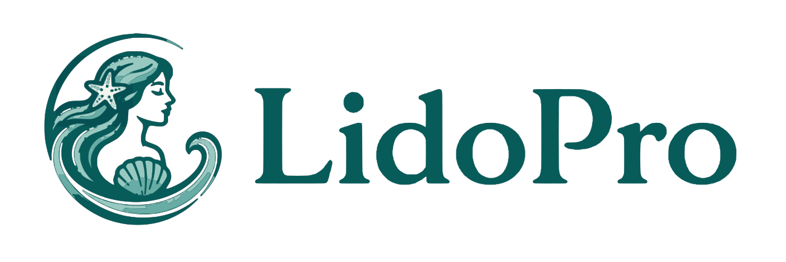
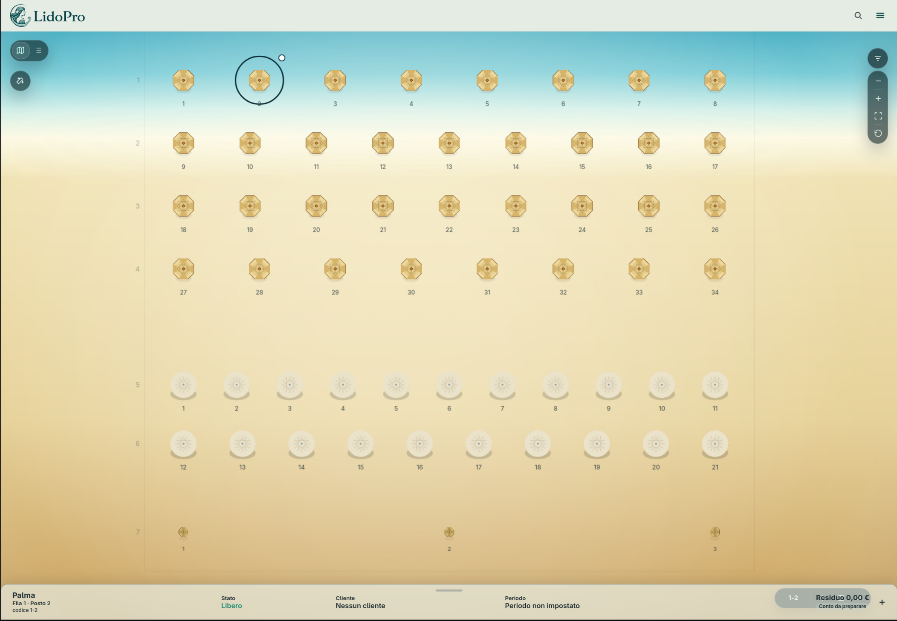

<p align="center">
  
</p>

# LidoPro

<p align="center">
  <strong>Commercial operating platform for beach establishments.</strong>
</p>

<p align="center">
  LidoPro is a proprietary commercial operating platform for beach establishments, combining parametric space planning, map-based daily operations, reservations, customer management, pricing, accounts, and service workflows into one connected product surface.
</p>

<p align="center">
  <em>Gestionale operativo per stabilimenti balneari: progettazione, mappa operativa, prenotazioni, clienti, listino, conti e servizi.</em>
</p>

<p align="center">
  
  
  
  
  
  
</p>

<p align="center">
  
  
  
  
  
</p>

<p align="center">
  
</p>

<p align="center">
  <em>LidoPro desktop preview - operational beach map, selected place detail, and local booking/account workflow.</em>
</p>

## Product Overview

LidoPro starts from the beach map as the operational surface. Lido Studio handles parametric design and planning of the beach layout, while the active operational map is the protected daily surface used by staff.

Clicking a place or operational item should open the working context around that object: status, customer, reservation, period, account state, equipment, and history. Customer, reservation, registry, account, and transaction surfaces are intended to be connected parts of the same operating platform rather than isolated modules.

The current implementation is local-first and operator-focused. Local-first is the current deployment/runtime posture, not the full product boundary. The product direction is a connected commercial platform for beach operations.

LidoPro is expanding toward distinct operational domains. Beach operations cover layout, places, assignments, reservations, customer activity, account state, and daily map work. Bar and service operations are a strategic product domain for orders, service items, food/beverage catalog flows, and beach delivery workflows. Catalog/listino, customers, registry, accounts, and reporting are shared foundations across these domains.

Future commercial platform direction includes customer booking portal, real payments and transactions, account/customer login, cloud synchronization, multi-device use, and intelligent assistance for parametric editing and operational help. These capabilities are not live unless explicitly implemented, configured, reviewed, and released.

<p align="center">
  
</p>

## Product Pillars

| Pillar | Description |
| --- | --- |
| Parametric Beach Studio | Current/local design and verification of beach layouts before publication. |
| Active Operational Map | Current/local protected daily map used by staff for places, reservations, customers, and account state. |
| Booking and Customer Operations | Current/local reservations, assignments, customer records, activity, and local workflow history. |
| Catalog, Pricing, and Accounts | Current/local tariffs, extras, articles, local ledger, and payment-record foundations. |
| Bar and Service Operations | Strategic product domain for orders, service items, food/beverage flows, and beach delivery workflows when implemented and released. |
| Connected Platform Direction | Strategic direction for cloud sync, customer portal, real payments, multi-device accounts, and intelligent assistance when implemented and released. |

## Operational Layout Model

The map is governed by three layout states:

| Concept | Meaning |
| --- | --- |
| Studio project draft | Editable planning state prepared in Lido Studio. |
| Layout preview | Verifiable proposal generated before publication. |
| Active layout | Protected operational projection used by staff during daily work. |

The active layout drives daily work in the operational map. Studio drafts must not mutate operational, customer, reservation, or account data directly; structural changes move through preview and controlled publication boundaries.

## Current Status

- Product stage: active development / commercial pre-release.
- Current runtime: local-first operator application.
- Primary daily runtime: Tauri Desktop.
- Primary field validation target: Android tablet.
- Browser: development preview only.
- Not live unless explicitly released: cloud sync, customer portal, real payments, hosted booking, SaaS operation, AI assistant.

## Commercial and Repository Status

LidoPro is proprietary commercial software. This repository is public/source-available for transparency, portfolio review, technical review, and evaluation. Repository access does not grant rights to copy, modify, redistribute, host, resell, white-label, deploy, sublicense, or use the application commercially.

Commercial use, pilots, deployments, partnerships, licensing, reseller activity, agency delivery, hosted operation, or customer evaluation require prior written permission.

<p align="center">
  
</p>

See [LICENSE.md](LICENSE.md), [COMMERCIAL.md](COMMERCIAL.md), [NOTICE.md](NOTICE.md), [TRADEMARK.md](TRADEMARK.md), [SECURITY.md](SECURITY.md), and [CONTRIBUTING.md](CONTRIBUTING.md).

## Runtime Architecture

```text
Svelte/Vite application
  |- Tauri Desktop        macOS / Linux desktop runtime
  |- Capacitor Android    Android phone/tablet native shell
  |- Capacitor iOS        iPad/iPhone target when intentionally enabled
  `- Browser/Vite         development preview only
```

The product source lives primarily in `src/`. Tauri and Capacitor are native shells around the same product application, not separate product codebases.

## Development and Device Matrix

| Target | Role | Tooling | Command / action | Notes |
| --- | --- | --- | --- | --- |
| macOS Desktop | primary desktop development runtime | Tauri, Rust, Cargo | `npm run app:dev` | preferred daily workflow |
| Linux Desktop | desktop validation/local build target | Tauri, Rust, Cargo, WebKitGTK/native dependencies | `npm run app:dev` / `npm run desktop:build` | validate on Linux before claiming Linux packages |
| Android phone/tablet | primary mobile/operational validation target | Capacitor Android, Android Studio, Android SDK, physical device/emulator | `npm run cap:sync:android` / `npm run cap:open:android` / `npm run cap:run:android` | Android tablet is the main operational field target |
| iPad/iPhone | Apple mobile validation target when enabled | Capacitor iOS, Xcode, iOS Simulator/device | `npx cap add ios` / `npx cap sync ios` / `npx cap open ios` | requires Xcode; not App Store distribution |
| Browser | fast UI/responsive preview only | Vite dev server, browser responsive mode | `npm run dev:server` | not product runtime, not native validation |

## Quick Start

```sh
git clone https://github.com/francescomaiomascio/lido-pro.git
cd lido-pro
nvm install
nvm use
npm install
npm run check
npm run build
npm run app:dev
```

`npm run app:dev` is the canonical local development command. It starts one Vite dev server at `http://localhost:5173` and opens LidoPro Desktop through Tauri against that same endpoint.

## Requirements

| Area | Requirements |
| --- | --- |
| Core | Git, Node.js from [.nvmrc](.nvmrc), npm |
| Desktop | Rust, Cargo, Tauri system dependencies |
| Android | Android Studio, Android SDK, emulator or physical Android device |
| iOS/iPad | macOS, Xcode, Xcode command line tools, Simulator or physical device |
| Linux | WebKitGTK/native Tauri dependencies, build tools |

## Daily Workflow

```text
Daily development:
1. Edit in VS Code.
2. Run npm run app:dev.
3. Use Tauri as the main desktop runtime.
4. Use browser responsive mode only for quick layout checks.
5. Validate Android/tablet through Android Studio or a physical device before closing UI work.
```

## Validation

| Scope | Commands |
| --- | --- |
| Core | `npm run check`, `npm run build`, `git diff --check` |
| Desktop | `npm run app:dev`, `npm run desktop:build` |
| Android | `npm run cap:sync:android`, `npm run cap:open:android`, `npm run cap:run:android` |
| iOS/iPad if configured | `npm run cap:sync:ios`, `npm run cap:open:ios`, `npm run cap:run:ios` |
| Browser preview | `npm run dev:server` |

Do not claim a platform, package, or binary is released unless it has been built, tested, signed/notarized where required, and explicitly approved for distribution.

Use Node 24 for Capacitor commands if the current shell Node version is below Capacitor requirements.

## Responsive Validation

| Category | Viewports |
| --- | --- |
| Desktop landscape | 1440x900, 1280x800 |
| Tablet landscape | 1180x820, 1138x712, 1024x768 |
| Tablet portrait | 820x1180, 768x1024 |
| Smartphone portrait | 430x932, 390x844, 360x800 |
| Smartphone landscape | 844x390, 932x430 |

Acceptance checks: no horizontal overflow, no clipped primary content, no overlapped text, controls do not cover critical content, panels scroll internally, map/canvas remains usable, primary actions remain reachable, and smartphone layouts are verticalized.

See [docs/platform/responsive-device-matrix.md](docs/platform/responsive-device-matrix.md) and [docs/platform/ui-responsive-checklist.md](docs/platform/ui-responsive-checklist.md).

## Repository Layout

```text
lido-pro/
  src/          Svelte product application
  src-tauri/    Tauri desktop shell
  android/      Capacitor Android shell
  public/       static and brand assets
  asset-lab/    asset generation pipeline
  docs/         product/platform/repo/commercial docs
  scripts/      local helper scripts
```

Generated/local folders such as `node_modules/`, `dist/`, `src-tauri/target/`, `android/**/build/`, local databases, exports, backups, and signing material must not be committed.

## Documentation

- Legal/commercial: [LICENSE.md](LICENSE.md), [COMMERCIAL.md](COMMERCIAL.md), [NOTICE.md](NOTICE.md), [TRADEMARK.md](TRADEMARK.md), [SECURITY.md](SECURITY.md), [CONTRIBUTING.md](CONTRIBUTING.md)
- Product/brand: [docs/product/product-boundary.md](docs/product/product-boundary.md), [docs/brand/lidopro-naming.md](docs/brand/lidopro-naming.md), [docs/commercial/README.md](docs/commercial/README.md)
- Repository policy: [docs/repo/language-policy.md](docs/repo/language-policy.md), [docs/repo/](docs/repo/)
- Platform: [docs/platform/](docs/platform/)
- Architecture/waves: [docs/architecture/](docs/architecture/), [docs/waves/](docs/waves/), [docs/README.md](docs/README.md)

## Repository Hygiene

Do not commit:

- `.env` files or local secrets
- real customer, booking, account, payment, or business data
- local SQLite databases with real data
- backups or exports with private data
- API keys, signing material, deployment credentials, or payment credentials
- `node_modules/`, `dist/`, or native build outputs
- Android, iOS, Tauri, Linux, or desktop release artifacts

Before making the repository public, run the public release checklist and a manual review for real data, secrets, private assets, and misleading product claims.

## Troubleshooting

- Wrong Node version: run `node -v`, then `nvm use`.
- Missing Rust/Tauri: install Rust, Cargo, and the Tauri prerequisites for the host platform.
- Port `5173` in use: run `lsof -i :5173`, stop the old process, then restart `npm run app:dev`.
- Android validation: Android Studio, Android SDK, and an emulator or physical device are required.
- iOS validation: Xcode and Xcode command line tools are required when iOS is intentionally enabled.
- Browser preview: useful for quick layout checks, but it does not validate native WebView, plugin, SQLite/native storage, package permission, signing, or device-specific behavior.

## Non-Goals / Not Included

Repository access does not include:

- public SaaS service access
- live payment processing unless explicitly implemented and released
- live customer portal unless explicitly implemented and released
- cloud sync/account service unless explicitly implemented and released
- public App Store, Mac App Store, or Linux package distribution
- production/customer deployment rights
- commercial use rights
- sublicensing or redistribution rights

## Commercial Contact

Commercial access, licensing, deployment, private pilots, partnerships, and customer evaluation require written permission from Francesco Maiomascio.

Contact details will be provided through authorized commercial channels.
