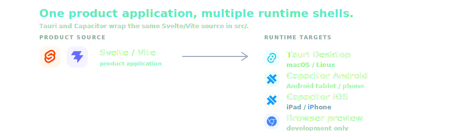

<p align="center">
  
</p>

<p align="center">
  <strong>Commercial operating platform for beach establishments.</strong>
</p>

<p align="center">
  LidoPro is a proprietary vertical operating platform for beach establishments. It combines an operator app, protected active Spiaggia layout, parametric Studio, booking and availability engine, customer records, Articoli/catalog pricing, accounts/folios, Registro events, staff, services, customer booking surfaces, and cloud-ready sync/account infrastructure into one connected product.
</p>

<p align="center">
  <em>Gestionale operativo per stabilimenti balneari: Spiaggia, Studio, prenotazioni, clienti, Articoli, conti, Registro, servizi, staff, app cliente, booking web e cloud sync.</em>
</p>

<p align="center">
  
  
  
  
  
  
</p>

<p align="center">
  
</p>

<p align="center">
  <em>LidoPro desktop preview — operator Spiaggia surface, selected place detail, and local booking/account workflow.</em>
</p>

## Product Overview

LidoPro is designed as a connected operating system for beach establishments. It is not just a beach map: it connects design, daily operations, bookings, customer records, Articoli, folios, Registro events, staff, services, and customer-facing booking surfaces around the active operational layout.

The operator app manages the daily workflow locally and reliably, while the broader platform prepares customer booking, account/sync, cloud backup, AI-assisted setup, and client-facing surfaces around the same operational model.

Studio designs layouts through drafts, previews, verification, and controlled publication. Spiaggia operates the protected active layout. Booking connects customers, availability, period, Articoli/pricing snapshots, Conti/Folio, payments, Registro, dashboard state, and future web/client-facing status.

Cloud / Account / Sync is the planned shared system layer for tenants, accounts, backup, synchronization, APIs, customer booking, storage, and AI gateway. It is not a replacement for the local operational engine.

<p align="center">
  
</p>

## Usage Modes

| Mode | Purpose | Status |
| --- | --- | --- |
| Operator App | Staff-facing app for Spiaggia, bookings, customers, accounts, Articoli, Registro and services. | Implemented / evolving |
| Web Booking | Customer-facing booking request and availability surface. | Planned / contract-first |
| Client App | Smartphone/tablet customer app for bookings, services, account status and payments. | Planned |
| Cloud / Sync | Account, tenant, backup, sync, multi-device and API layer. | Planned architecture |
| AI Assistant | Operator-only assistant for drafts, imports, booking/account suggestions and Studio help. | Planned / operator-only |

## Product Areas

| Area | Scope | Current status |
| --- | --- | --- |
| Home | Operational dashboard fed by booking, folio, Registro, Spiaggia, Staff and Servizi data. | Partial / final rebuild later |
| Spiaggia | Protected active layout for daily operations, place selection, booking, customer, account and payments. | Implemented / evolving |
| Studio | Parametric layout design, sketch, draft, preview, verification and controlled publication. | Implemented / evolving |
| Booking | Requests, reservations, availability, pairing, lifecycle, inbox and customer-facing state. | Implemented / evolving |
| Clienti | Customer records, profiles, history and pairing. | Implemented / evolving |
| Articoli | Catalog, pricing rules, included equipment, extras, service items and account lines. | Implemented / evolving |
| Conti / Folio | Account totals, residuals, payments, adjustments and booking economic state. | Implemented / evolving |
| Registro | Operational events, movements, payment/account/booking history and audit direction. | Implemented / evolving |
| Servizi | Service domain including Bar, orders, extra services and future service requests. | Planned / foundation pending |
| Staff | Employees, roles, assignments and operational presence. | Shell / foundation pending |
| Client App | Customer-facing mobile/tablet experience. | Planned |
| Web Booking | Public booking and request workflow for the lido's customers. | Planned |
| Cloud / Account / Sync | Tenant, account, backup, sync, multi-device, APIs and storage. | Planned architecture |
| AI Integration | Operator-only assistant, local/cloud adapters, typed action drafts and imports. | Planned |

## Layout and Operations Model

LidoPro separates design work from daily operations. Studio drafts can be edited and reviewed, while Spiaggia remains the protected active operational surface used by staff.

<p align="center">
  
</p>

The layout pipeline is:

```text
Studio Project Draft
-> Layout Preview
-> Verification
-> Controlled Publication
-> Active Layout Projection
-> Spiaggia Operational View
-> Booking / Conti / Registro
```

Studio does not directly mutate operational Spiaggia. Spiaggia consumes the protected `activeLayoutProjection`, and booking/account flows attach to that active operational layout. Publication is the boundary between design and operation: drafts do not directly mutate customer, reservation, account, or daily workflow data.

## Booking Spine

Booking is not a standalone table. It is the operational transaction connecting:

```text
Cliente
-> Booking / Richiesta
-> Disponibilita
-> Posto / Periodo
-> Articoli / Pricing Snapshot
-> Conto / Folio
-> Pagamento
-> Registro
-> Dashboard
-> Web/App cliente
```

The current implementation includes an evolving domain contract, local-first persistence, availability engine, customer pairing, selected-item operator booking console, lifecycle/change request handling, pricing snapshots, Folio boundary, Registro events, and Booking Inbox. This is not a complete public web booking or client-app runtime yet.

## Local-first and Cloud-ready Architecture

LidoPro is designed local-first: the operator app reads and writes locally for reliability on tablet, smartphone, and desktop, including when connectivity is unstable. SQLite/local storage remains the operational engine.

The cloud layer is planned as the system layer for tenant/account, backup, synchronization, APIs, customer booking, storage, multi-device operation, and AI gateway. The product does not require replacing local SQLite with a fully online runtime, and cloud sync is not claimed as live in the current implementation.

## AI Integration

AI is planned as an operator-only assistant first. It can prepare booking drafts, customer/import suggestions, Articoli/catalog imports, account/folio draft actions, and Studio layout suggestions.

The rule is: AI proposes, the operator confirms, the system validates, and only then data is written. A local LAN AI adapter and a cloud AI gateway are planned boundaries. AI is not initially exposed to the Client App or Web Booking surfaces, and provider keys must not live inside client mobile apps.

## Current Status

| Area | Status |
| --- | --- |
| Product stage | Active development / commercial pre-release |
| Operator app | Implemented and evolving |
| Spiaggia active layout | Implemented and evolving |
| Studio / parametric design | Implemented and evolving |
| Booking core | Implemented and evolving |
| Articoli / pricing / extras | Implemented and evolving |
| Conti / Folio | Implemented and evolving |
| Registro | Implemented and evolving |
| Staff | Shell / foundation pending |
| Servizi / Bar | Planned / foundation pending |
| Client App | Planned |
| Web Booking | Planned |
| Cloud sync/account | Planned architecture |
| AI assistant | Planned operator-only integration |
| Browser | Development preview only |
| Runtime posture | Local-first, cloud-ready |
| Primary desktop runtime | Tauri Desktop |
| Primary field validation target | Android tablet |

## Commercial and Repository Status

LidoPro is proprietary commercial software. This repository is public/source-available for transparency, portfolio review, technical review, and evaluation. Repository access does not grant rights to copy, modify, redistribute, host, resell, white-label, deploy, sublicense, or use the application commercially.

Repository access does not provide production deployment rights, commercial use rights, hosted service access, public app-store distribution, sublicensing, or redistribution rights.

Commercial use, pilots, deployments, partnerships, licensing, reseller activity, agency delivery, hosted operation, or customer evaluation require prior written permission.

See [LICENSE.md](LICENSE.md), [COMMERCIAL.md](COMMERCIAL.md), [NOTICE.md](NOTICE.md), [TRADEMARK.md](TRADEMARK.md), [SECURITY.md](SECURITY.md), and [CONTRIBUTING.md](CONTRIBUTING.md).

## Runtime Architecture

<p align="center">
  
</p>

The product source lives primarily in `src/`. Tauri and Capacitor are native shells around the same product application, not separate product codebases.

## Quick Start

```sh
git clone https://github.com/francescomaiomascio/lido-pro.git
cd lido-pro
nvm install
nvm use
npm install
npm run check
npm run build
npm run app:dev
```

## Development Matrix

| Area | Tooling | Commands / notes |
| --- | --- | --- |
| Core | Git, Node.js from [.nvmrc](.nvmrc), npm | `npm install`, `npm run check`, `npm run build` |
| Desktop | Tauri, Rust, Cargo | `npm run app:dev`, `npm run desktop:build` |
| Android | Capacitor Android, Android Studio, Android SDK | `npm run cap:sync:android`, `npm run cap:open:android`, `npm run cap:run:android` |
| iOS/iPad | Capacitor iOS when enabled, Xcode | `npx cap sync ios`, `npx cap open ios` |
| Linux | Tauri, WebKitGTK/native dependencies | validate on Linux before claiming package support |
| Browser | Vite dev server | `npm run dev:server`; preview only, not product runtime |

`npm run app:dev` is the canonical local development command. It starts one Vite dev server at `http://localhost:5173` and opens LidoPro Desktop through Tauri against that same endpoint. VS Code is the primary editor. Tauri is the main desktop runtime. Android tablet validation should use Android Studio or a physical device before closing UI work.

## Responsive Quality Gate

UI changes must be checked across desktop, tablet, and smartphone layouts.

| Category | Viewports |
| --- | --- |
| Desktop | 1440x900, 1280x800 |
| Tablet landscape | 1180x820, 1138x712, 1024x768 |
| Tablet portrait | 820x1180, 768x1024 |
| Smartphone portrait | 430x932, 390x844, 360x800 |
| Smartphone landscape | 844x390, 932x430 |

Acceptance: no horizontal overflow, no clipped content, no overlapped text, no controls covering critical content, internal panel scrolling, reachable primary actions, usable map/canvas, and verticalized smartphone layouts.

See [docs/platform/responsive-device-matrix.md](docs/platform/responsive-device-matrix.md) and [docs/platform/ui-responsive-checklist.md](docs/platform/ui-responsive-checklist.md).

## Repository Layout

```text
lido-pro/
  src/          product application source
  src-tauri/    Tauri desktop shell
  android/      Capacitor Android shell
  public/       static and brand assets
  asset-lab/    asset generation pipeline
  docs/         product, platform, repo, commercial docs
  scripts/      local helper scripts
```

Generated/local folders such as `node_modules/`, `dist/`, `src-tauri/target/`, `android/**/build/`, local databases, exports, backups, signing material, and release artifacts must not be committed.

## Documentation

- Legal/commercial: [LICENSE.md](LICENSE.md), [COMMERCIAL.md](COMMERCIAL.md), [NOTICE.md](NOTICE.md), [TRADEMARK.md](TRADEMARK.md), [SECURITY.md](SECURITY.md), [CONTRIBUTING.md](CONTRIBUTING.md)
- Product/brand: [docs/product/product-boundary.md](docs/product/product-boundary.md), [docs/brand/lidopro-naming.md](docs/brand/lidopro-naming.md), [docs/commercial/README.md](docs/commercial/README.md)
- Repository policy: [docs/repo/language-policy.md](docs/repo/language-policy.md), [docs/repo/](docs/repo/)
- Platform: [docs/platform/](docs/platform/)
- Architecture/waves: [docs/architecture/](docs/architecture/), [docs/waves/](docs/waves/), [docs/README.md](docs/README.md)

## Repository Hygiene

Do not commit:

- `.env` files or local secrets
- real customer, booking, account, payment, or business data
- local SQLite databases with real data
- backups or exports with private data
- API keys, signing material, deployment credentials, or payment credentials
- `node_modules/`, `dist/`, or native build outputs
- Android, iOS, Tauri, Linux, or desktop release artifacts

Before making the repository public, run the public release checklist and a manual review for real data, secrets, private assets, and misleading product claims.

## Troubleshooting

- Wrong Node version: run `node -v`, then `nvm use`.
- Missing Rust/Tauri: install Rust, Cargo, and the Tauri prerequisites for the host platform.
- Linux Wayland/WebKitGTK: use `npm run app:dev`; the repository launcher applies the local WebKitGTK renderer workaround when needed.
- Port `5173` in use: run `lsof -i :5173`, stop the old process, then restart `npm run app:dev`.
- Android Studio path: use `npm run cap:open:android`; it auto-detects common Linux installs. If needed, set `CAPACITOR_ANDROID_STUDIO_PATH=/full/path/to/studio.sh`.
- Android validation: Android Studio, Android SDK, and an emulator or physical device are required.
- iOS validation: Xcode and Xcode command line tools are required when iOS is intentionally enabled.
- Browser preview: useful for quick layout checks, but it does not validate native WebView, plugin, SQLite/native storage, package permission, signing, or device-specific behavior.

## Commercial Contact

Commercial access, licensing, deployment, private pilots, partnerships, and customer evaluation require written permission from Francesco Maiomascio.

Contact details will be provided through authorized commercial channels.
