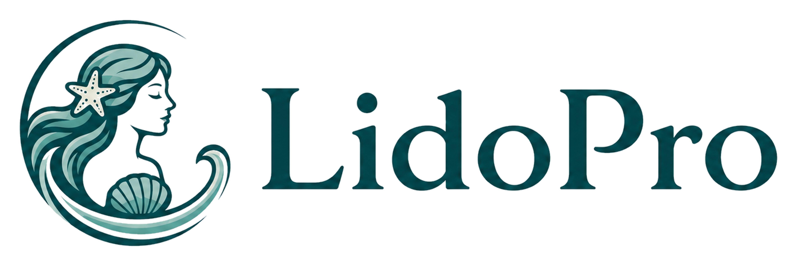

<p align="center">
  
</p>

# LidoPro

<p align="center">
  <strong>Local-first operating software for beach club operations.</strong>
</p>

<p align="center">
  LidoPro is a proprietary commercial local-first application for beach club operations - from map-based layout planning and service management to local booking, customers, pricing, and account tracking.
</p>

<p align="center">
  <strong>Status:</strong> source-available commercial repository | Tauri desktop first | Capacitor Android validation target | browser preview for development only
</p>

<p align="center">
  
</p>

<p align="center">
  <em>LidoPro desktop preview - operational beach map, selected place detail, and local booking/account workflow.</em>
</p>

## What LidoPro is

- Local-first beach management application for operational work inside a beach club.
- Map-first workflow for layout planning, beach-place state, and service management.
- Booking, customer, pricing, and account foundations designed around local operation.
- Commercial product prepared for controlled deployment, validation, and licensing.

## Public Repository / Commercial Product Status

LidoPro is proprietary commercial software. Repository access may be public/source-available for transparency, portfolio review, technical review, and evaluation, but it does not grant an OSI-style public software license.

Repository access does not grant permission to copy, modify, redistribute, host, resell, white-label, deploy, sublicense, or use the application commercially. Commercial use, private pilots, deployments, partnerships, licensing, reseller activity, agency delivery, hosted operation, or customer evaluation require prior written permission from Francesco Maiomascio.

Cloud, payment, account, customer portal, hosted booking, and SaaS capabilities are commercial product boundaries. They must only be described as live when implemented, configured, reviewed, and explicitly released.

Legal and commercial boundary files:

- [LICENSE.md](LICENSE.md)
- [COMMERCIAL.md](COMMERCIAL.md)
- [NOTICE.md](NOTICE.md)
- [TRADEMARK.md](TRADEMARK.md)
- [SECURITY.md](SECURITY.md)
- [CONTRIBUTING.md](CONTRIBUTING.md)

## Current Capabilities

| Area | Module | Current state |
| --- | --- | --- |
| Map/layout | Lido Studio | local map and layout operations |
| Booking | Lido Booking | local reservation and beach-place workflow |
| Customers | Lido Clienti | registry and assignment foundations |
| Pricing | Lido Listino | catalog, extras, and tariff foundations |
| Accounts | Local accounts | local ledger and payment-record foundations |
| Desktop | LidoPro Desktop | Tauri development/runtime shell |
| Android | LidoPro Mobile | Capacitor Android validation target |

> **Commercial boundaries:** Lido Pay is the payment integration boundary, Lido Cloud is the sync/account/customer portal boundary, and SaaS/hosted booking is a separate commercial release boundary. None of these areas should be treated as live unless explicitly implemented, configured, reviewed, and released.

## Platform Model

### Primary Development Runtime

| Platform | Runtime | Role | Main command |
| --- | --- | --- | --- |
| macOS Desktop | Tauri | primary desktop development runtime | `npm run app:dev` |
| Linux Desktop | Tauri | Linux desktop validation and local builds | `npm run app:dev`, `npm run desktop:build` |

### Native / Mobile Validation

| Platform | Runtime | Role | Main command / action |
| --- | --- | --- | --- |
| Android phone/tablet | Capacitor Android | native mobile validation target | `npm run cap:sync:android`, `npm run cap:open:android`, `npm run cap:run:android` |
| iPhone/iPad | Capacitor iOS when intentionally enabled | packaging and validation target | `npm install @capacitor/ios`, `npx cap add ios`, `npx cap sync ios`, `npx cap open ios` |

### Preview Only

| Platform | Runtime | Role | Main command |
| --- | --- | --- | --- |
| Browser | Vite dev server | fast UI inspection and responsive preview only | `npm run dev:server` |

```text
Svelte/Vite UI
   |- Tauri Desktop: macOS/Linux
   |- Capacitor Android: phone/tablet
   |- Capacitor iOS: iPad/iPhone target when enabled
   `- Browser: preview only
```

## Quick Start

Core requirements:

- Git
- Node.js version declared in [.nvmrc](.nvmrc)
- npm
- Rust, Cargo, and Tauri system dependencies for desktop work
- Android Studio and Android SDK for Android validation
- Xcode for iPad/iPhone validation when iOS is intentionally enabled

```sh
git clone https://github.com/francescomaiomascio/lido-pro.git
cd lido-pro
nvm install
nvm use
npm install
npm run check
npm run build
npm run app:dev
```

`npm run app:dev` is the canonical local development command. It starts one Vite dev server at `http://localhost:5173` and opens LidoPro Desktop through Tauri against that same endpoint.

## Recommended Development Loop

```text
Daily development:
1. Edit in VS Code.
2. Run npm run app:dev.
3. Use Tauri as the main desktop runtime.
4. Use browser responsive mode only for quick layout checks.
5. Validate Android/tablet through Android Studio or a physical device when closing UI work.
```

## Running By Platform

### macOS Desktop / Tauri

```sh
npm run app:dev
npm run desktop:dev
npm run desktop:build
npm run desktop:build:mac
```

`desktop:dev` is an alias for the desktop development workflow. Desktop builds are unsigned/local unless release signing and notarization are explicitly configured.

### Linux Desktop / Tauri

```sh
npm run app:dev
npm run desktop:build
npm run desktop:build:linux
```

Linux may require WebKitGTK and other Tauri system dependencies. AppImage or deb artifacts are validation outputs only when actually produced, tested, and explicitly approved for distribution.

### Android Tablet / Smartphone

```sh
npm run cap:sync:android
npm run cap:open:android
npm run cap:run:android
```

Android Studio is required for SDK, emulator, and device management. Browser responsive mode does not validate native WebView behavior, plugins, storage, permissions, or device constraints.

### iPad / iPhone

iOS/iPad support is a packaging and validation target. If `ios/` is not present, the platform has not been intentionally added yet.

```sh
npm install @capacitor/ios
npx cap add ios
npx cap sync ios
npx cap open ios
```

Xcode is required. Simulator or device validation is different from signing, provisioning, TestFlight, and app-store distribution work.

### Browser Preview

```sh
npm run dev:server
npm run web:dev
npm run dev
```

Browser preview is available at `http://localhost:5173`. It is for fast UI and responsive inspection only, not the product runtime.

## Validation

Core validation:

| Purpose | Command |
| --- | --- |
| Type/Svelte check | `npm run check` |
| Production web build | `npm run build` |
| Whitespace/diff safety | `git diff --check` |

Capacitor:

| Purpose | Command |
| --- | --- |
| Build and sync configured platforms | `npm run cap:sync` |
| Build and sync Android | `npm run cap:sync:android` |
| Open Android Studio | `npm run cap:open:android` |
| Build and run Android target | `npm run cap:run:android` |
| Build and sync iOS if configured | `npm run cap:sync:ios` |
| Open Xcode if iOS is configured | `npm run cap:open:ios` |
| Build and run iOS target if configured | `npm run cap:run:ios` |

Desktop:

| Purpose | Command |
| --- | --- |
| Tauri desktop dev | `npm run app:dev` |
| Tauri desktop dev alias | `npm run desktop:dev` |
| Tauri desktop build | `npm run desktop:build` |
| macOS-named desktop build alias | `npm run desktop:build:mac` |
| Linux-named desktop build alias | `npm run desktop:build:linux` |
| Direct Tauri build alias | `npm run tauri:build` |

## Responsive Validation Matrix

Responsive validation is mandatory for UI changes. Desktop-only validation is insufficient.

| Category | Viewports |
| --- | --- |
| Desktop landscape | 1440 x 900, 1280 x 800 |
| Tablet landscape | 1180 x 820, 1138 x 712, 1024 x 768 |
| Tablet portrait | 820 x 1180, 768 x 1024 |
| Smartphone portrait | 430 x 932, 390 x 844, 360 x 800 |
| Smartphone landscape | 844 x 390, 932 x 430 |

Acceptance checks:

- no horizontal overflow
- no clipped primary content
- no overlapped text
- no controls covering critical content
- bottom sheets and side panels scroll internally
- map/canvas surfaces remain visible and operable
- primary actions remain reachable
- touch targets remain usable
- tablet portrait is not treated as squeezed desktop
- smartphone portrait has verticalized layout
- smartphone landscape does not lose core navigation

See [docs/platform/responsive-device-matrix.md](docs/platform/responsive-device-matrix.md) and [docs/platform/ui-responsive-checklist.md](docs/platform/ui-responsive-checklist.md).

## Repository Layout

```text
lido-pro/
  android/
  asset-lab/
  docs/
  public/
  scripts/
  src/
  src-tauri/
  README.md
  LICENSE.md
  COMMERCIAL.md
  NOTICE.md
  TRADEMARK.md
  SECURITY.md
  CONTRIBUTING.md
```

Folder roles:

- `src/`: Svelte product application source.
- `public/`: static public assets loaded by the frontend, including brand and README assets.
- `android/`: Capacitor Android native shell.
- `src-tauri/`: Tauri Desktop native shell.
- `asset-lab/`: internal asset generation and rendering pipeline.
- `docs/`: product, platform, commercial, legal, repository, architecture, and wave documentation.
- `scripts/`: local development, validation, and repository helper scripts.

## Documentation Map

Legal/commercial:

- [LICENSE.md](LICENSE.md)
- [COMMERCIAL.md](COMMERCIAL.md)
- [NOTICE.md](NOTICE.md)
- [TRADEMARK.md](TRADEMARK.md)
- [SECURITY.md](SECURITY.md)
- [CONTRIBUTING.md](CONTRIBUTING.md)
- [docs/repo/public-commercial-repo-policy.md](docs/repo/public-commercial-repo-policy.md)

Product/brand:

- [docs/product/product-boundary.md](docs/product/product-boundary.md)
- [docs/brand/lidopro-naming.md](docs/brand/lidopro-naming.md)
- [docs/commercial/README.md](docs/commercial/README.md)

Platform:

- [docs/platform/desktop-tauri-cutover.md](docs/platform/desktop-tauri-cutover.md)
- [docs/platform/development-workflows.md](docs/platform/development-workflows.md)
- [docs/platform/macos-desktop-workflow.md](docs/platform/macos-desktop-workflow.md)
- [docs/platform/linux-desktop-packaging.md](docs/platform/linux-desktop-packaging.md)
- [docs/platform/desktop-storage-boundary.md](docs/platform/desktop-storage-boundary.md)
- [docs/platform/responsive-device-matrix.md](docs/platform/responsive-device-matrix.md)
- [docs/platform/ui-responsive-checklist.md](docs/platform/ui-responsive-checklist.md)

Repository:

- [docs/repo/public-release-checklist.md](docs/repo/public-release-checklist.md)
- [docs/repo/repository-hygiene.md](docs/repo/repository-hygiene.md)
- [docs/repo/repository-naming.md](docs/repo/repository-naming.md)
- [docs/repo/repository-structure.md](docs/repo/repository-structure.md)
- [docs/repo/file-ownership-map.md](docs/repo/file-ownership-map.md)
- [docs/repo/asset-directory-policy.md](docs/repo/asset-directory-policy.md)

Waves and architecture:

- [docs/waves/](docs/waves/)
- [docs/architecture/](docs/architecture/)
- [docs/README.md](docs/README.md)

## Repository Hygiene

The repository tracks source code, documentation, configuration, and curated assets required to build the application.

Do not commit:

- `.env` files or local secrets
- real customer, booking, account, payment, or business data
- SQLite database files with real data
- backups or exports with private data
- API keys, deployment credentials, signing keys, keystores, certificates, or payment credentials
- generated Android/iOS/Tauri release artifacts
- `node_modules/`
- `dist/`
- Android native build outputs
- Tauri/Rust build outputs
- local editor or operating system files

Before making the repository public, run the public release checklist and a manual review for real data, secrets, private assets, and misleading product claims.

## Troubleshooting

Wrong Node version:

- Run `node -v`.
- Use `nvm use`.
- Capacitor requires Node.js 22 or newer.

Tauri/Rust missing:

- Install Rust and Cargo.
- Install the Tauri system prerequisites for the host platform.
- Run `npm run app:dev` again after dependencies are available.

Port `5173` already in use:

```sh
lsof -i :5173
kill <PID>
```

Android Studio missing SDK/device:

- Install Android Studio and Android SDK.
- Configure an emulator or connect a physical Android device.
- On low-RAM Macs, prefer Tauri Desktop plus a physical Android device over a heavy emulator.

Xcode required for iOS:

- Install Xcode and Xcode command line tools.
- Use Xcode Simulator or a physical device for iPad/iPhone validation.
- Signing, provisioning, TestFlight, and app-store distribution are release tasks, not repository setup.

Browser preview limitations:

- Browser preview is not native validation.
- It does not validate native WebView, plugin, SQLite/native storage, package permission, signing, or device-specific behavior.

## Non-Goals / Not Included From Repository Access

Repository access does not include:

- public SaaS service access
- live payment processing unless explicitly implemented and released
- live customer portal unless explicitly implemented and released
- cloud sync/account service unless explicitly implemented and released
- public app-store distribution
- public Linux package distribution
- production/customer deployment rights
- commercial use rights
- sublicensing or redistribution rights

## Commercial Contact

Commercial access, licensing, deployment, private pilots, partnerships, and customer evaluation require written permission from Francesco Maiomascio.

Contact details will be provided through authorized commercial channels.
